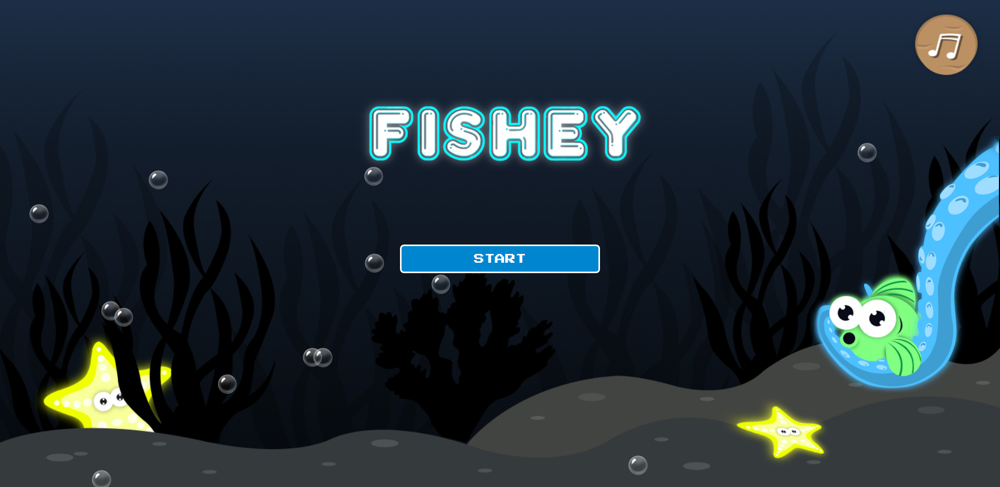
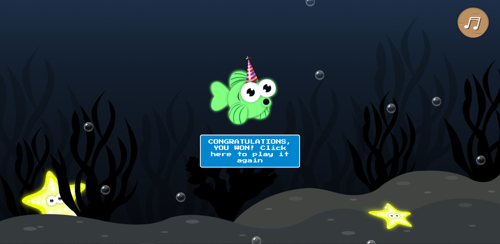
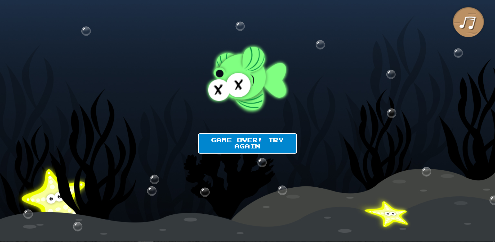
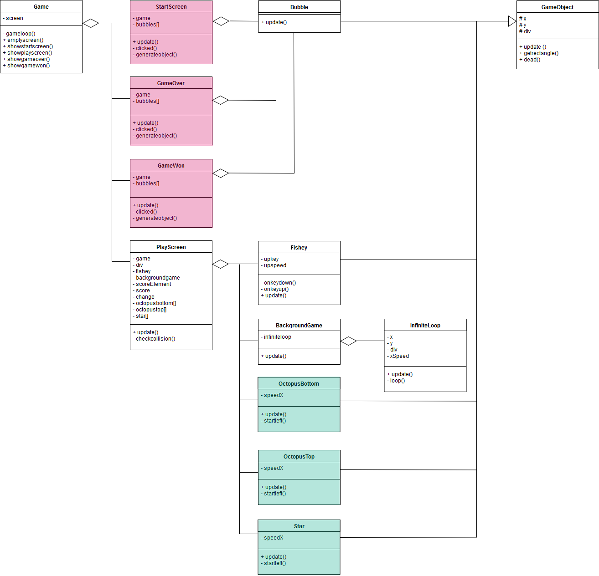
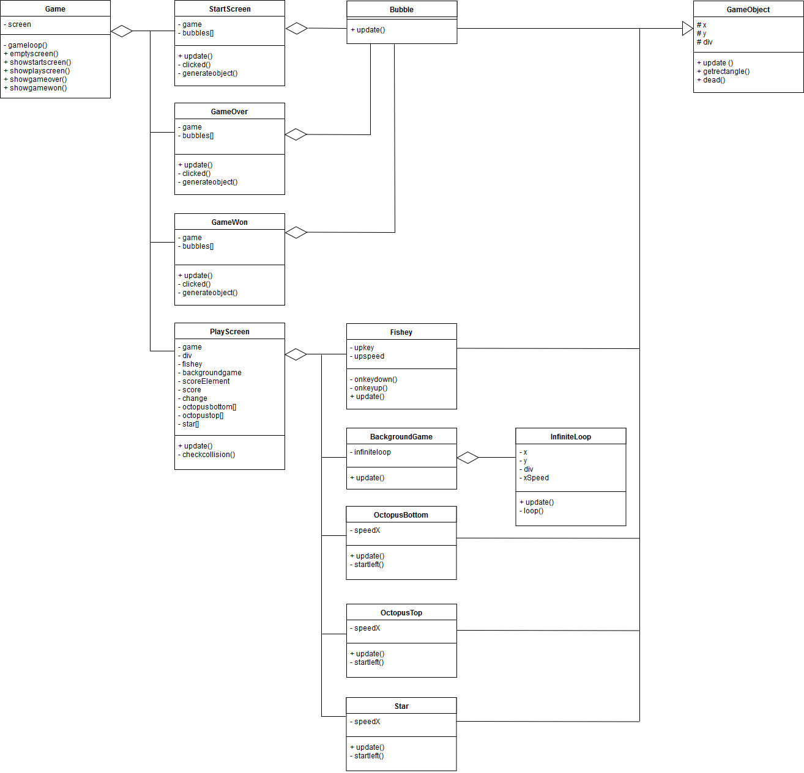
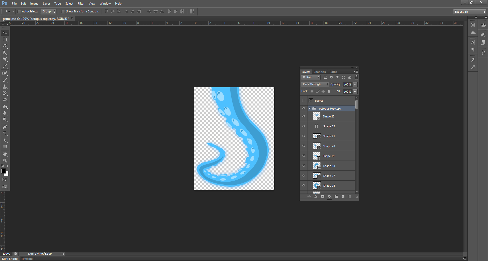

# Fishey
Game for PRG04.

- Verzamel 10 sterren en win de game! Kijk uit voor de octopusarmen anders is het game over...
- Het spel is te besturen met behulp van de pijltjestoets naar boven.

---

### Speelbare game
http://projectlotte.me/PRG04/

---

### Installatie
1. Clone de respository.
2. Run het project via localhost.
3. En spelen/kijken maar!

---

### Checklist
- [x] De game heeft een startscherm


- [x] De game heeft een eindscherm



- [x] De game bevat geen bugs (voor zover ik weet)

---

### Toelichting OOP
- [x] Classes <br />
Voor de elementen die ik op het scherm toon(fishey, bubbles, star etc.) heb ik classes gebruikt, zodat het overzichtelijk blijft. Een ander voordeel van classes is dat ze hergebruikt kunnen worden.
```
/// <reference path="../gamescreen/gameobject.ts"/>

class Bubble extends GameObject {
    constructor() {
        super("bubble",Math.floor(Math.random()*window.innerWidth),Math.floor(Math.random()*window.innerHeight))
    }

    public update():void {
         // Elke keer wordt er 1 vanaf gehaald. (Bubbles gaan omhoog)
         this.y --
         this.div.style.transform = `translate(${this.x}px, ${this.y}px)`
 
         // als y kleiner is dan -100, dan veranderd de y in 800
         if (this.y < -100){
             this.y = 800
         }
    }
}
```
- [x] Encapsulation <br />
Bij encapsulation(inkapseling) zet je de properties en functies op public, private of protected. Hierdoor wordt het veiliger. 
Wanneer is het handig om welke te gebruiken? <br />
Public: Als je wilt dat variabelen niet alleen vanuit het object zelf kunnen worden aangepast maar ook op andere plaatsen <br />
Private: Als je wilt dat variabelen alleen vanuit het object zelf kunnen worden aangepast <br />
Protected: Als je wilt dat de "children" de variabelen kunnen aanpassen en de rest niet. Dit gebruik je bijvoorbeeld bij inheritance.  <br />
Voorbeeld encapsulation:
```
/// <reference path="../gamescreen/gameobject.ts"/>

class OctopusBottom extends GameObject {
    private speedX: number;

    constructor() {
        super("octopusbottom", 1500,500);

        //De snelheid waarmee octopusbottom naar links verplaatst
        this.speedX = -8
    }
    public update():void {
        this.x += this.speedX;

        //scherm groter dan breedte scherm? -> startleft functie uitvoeren
        if (this.x > window.innerWidth) {
            this.startLeft();
        }
        this.div.style.left = `${this.x}px`;
        this.div.style.top = `${this.y}px`;
    }
    private startLeft() {
        this.x = this.x = this.div.getBoundingClientRect().width * -1;
    }
}
```
- [x] Composition <br />
Dit kun je mooi terug zien in onderstaand klassendiagram. Op de plekken waar er een ruitje is getekend, wordt gebruik gemaakt van composition. Zo wordt er bijvoorbeeld gebruik gemaakt van composition in game.ts. Hier roep ik startscreen, playscreen, gameover en gamewon op. Deze komen allemaal uit aparte classen. 

```
class Game {
    private screen: any;

    constructor() {
        //Open het startscherm wanneer de pagina wordt geladen
        this.screen = new StartScreen(this)
        //Laat de game loopen
        this.gameLoop()
    }

    //Update het gamescherm in de gameloop
    private gameLoop():void {
        this.screen.update()
        requestAnimationFrame(() => this.gameLoop())
    }

    //Verwijder de elementen uit de voorgrond
    public emptyScreen() {
        let y = document.getElementsByTagName("foreground")[0]
        y.innerHTML = ""
    }

    //Laat het starscherm zien
    public showStartScreen(screen: StartScreen) {
        this.screen = screen
        this.screen.update()
    }

    //Laat het speelscherm zien
    public showPlayScreen(screen: PlayScreen) {
        this.screen = screen
        this.screen.update()
    }

    //Laat het gameover scherm zien
    public showGameOver (screen: GameOver) {
        this.screen = screen
        this.screen.update()
    }
    //Laat het gamewon scherm zien
    public showGameWon (screen: GameWon) {
        this.screen = screen
        this.screen.update()
    }
}
```
- [x] Inheritance <br />
Het voordeel van inheritance(overerving) is dat je bepaalde stukjes code kunt overerven, zodat code niet dubbel hoeft te worden geschreven. Hierdoor blijft de code overzichtelijk. In mijn game heb ik inheritance toegepast op de volgende onderdelen: Fishey.ts, BackgroundGame.ts, OctopusTop.ts en Star.ts. Zij erven de x, y en div properties van GameObject.ts. Ook erven zij de update, getrectangle en dead functies. <br />

gameobject.ts
```
class GameObject {
    protected x: number
    protected y: number
    protected div: HTMLElement

    constructor(type:string, x:number, y:number) {
        this.x = x
        this.y = y

        //Er wordt een div aangemaakt en deze wordt in de foreground geplaatst
        let z = document.getElementsByTagName("foreground")[0]
        this.div = document.createElement(type)
        z.appendChild(this.div)
    }

    public update():void {
        this.div.style.transform = `translate(${this.x}px, ${this.y}px`
    }

    public getRectangle() {
        return this.div.getBoundingClientRect();
    }

    public dead() {
        this.div.remove();
    }
}
class GameObject {
    protected x: number
    protected y: number
    protected div: HTMLElement

    constructor(type:string, x:number, y:number) {
        this.x = x
        this.y = y

        //Er wordt een div aangemaakt en deze wordt in de foreground geplaatst
        let z = document.getElementsByTagName("foreground")[0]
        this.div = document.createElement(type)
        z.appendChild(this.div)
    }

    public update():void {
        this.div.style.transform = `translate(${this.x}px, ${this.y}px`
    }

    public getRectangle() {
        return this.div.getBoundingClientRect();
    }

    public dead() {
        this.div.remove();
    }
}
````

octopusbottom.ts <br />
````
/// <reference path="../gamescreen/gameobject.ts"/>

class OctopusBottom extends GameObject {
    private speedX: number;

    constructor() {
        super("octopusbottom", 1500,500);

        //De snelheid waarmee octopusbottom naar links verplaatst
        this.speedX = -8
    }
    public update():void {
        this.x += this.speedX;

        //scherm groter dan breedte scherm? -> startleft functie uitvoeren
        if (this.x > window.innerWidth) {
            this.startLeft();
        }
        this.div.style.left = `${this.x}px`;
        this.div.style.top = `${this.y}px`;
    }
    private startLeft() {
        this.x = this.x = this.div.getBoundingClientRect().width * -1;
    }
}
````
Het had netter geweest als ik voor de volgende onderdelen die gekleurd zijn ook inheritance had gebruikt. Door gebrek aan tijd ben ik hier helaas niet meer aan toegekomen.



---

### Klassendiagram


---

### Peer review
In week 6 heb ik op de game van Alara feedback gegeven: https://github.com/AlaraEdda/CMTTHE01-4-GAME/issues/1

---

### Extra uitdaging
Ik heb de volgende extra uitdagingen in mijn game verwerkt:
- [x] De game ziet er zeer verzorgd uit dankzij goed uitgewerkt UI design en artwork. <br />
Het hele ontwerp van de game heb ik zelf getekend met behulp van Photoshop.
 <br />

- [x] De game gebruikt een externe library uit de lijst die te vinden is in de modulewijzer. <br />
Voor de game heb ik de Howler library gebruikt voor het afspelen van muziek.
